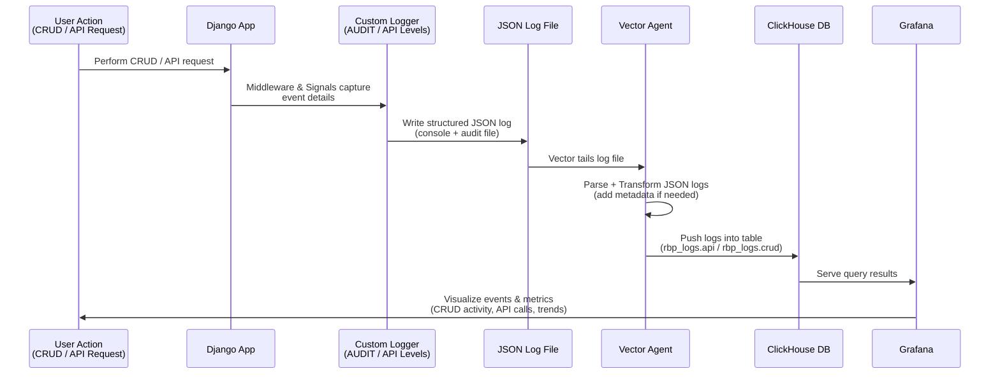

# Django Activity Audit — Implementation Guide

**Package:** [GitHub](https://github.com/shree256/django-activity-audit) | [PyPI](https://pypi.org/project/django-activity-audit/)

---

## Background

We are extending Django's logging system to capture **CRUD and API events** directly as structured logs, instead of writing them into separate audit tables. These logs are ingested into **ClickHouse via Vector** and visualized in **Grafana**.

---

## Why This Change?

The current implementation uses the `django-easy-audit` package to track CRUD events:

- Events are captured via middleware and signals.
- Audit models are created and stored in the database.
- A scheduled job pushes audit data to ClickHouse every **24 hours**.

### Problems with the Current Approach

- Every CRUD operation generates an **additional database write** to create an audit object.
- This increases the number of database operations, **prolongs transaction durations**, and adds to infrastructure costs.
- The audit data captured is **not well-structured** for analytics and visualization.

---

## Goal

Push application logs to ClickHouse via [Vector](https://vector.dev/) and visualize them using [Grafana](https://grafana.com/).

To align with this architecture:

- Extend Django's native logging system to capture CRUD events.
- Write audit data directly to log files in a structured format (JSON).
- Allow Vector to pick up audit logs, transform them if needed, and push them to ClickHouse seamlessly.

This approach will **eliminate extra database writes** and provide **cleaner, more structured audit data** that is easier to visualize and analyze.

### Architecture Flow



---

## Proposed Implementation

| Component | Description |
|-----------|-------------|
| **Custom Logger** | Extend Python's `Logger` to introduce an `AUDIT` level (18) and `API` level (19) — positioned between `DEBUG` (10) and `WARNING` (20). |
| **Middleware & Signals** | Capture all CRUD operations using signals. Capture all request-response cycles using middleware. |
| **Log Structure** | Format all audit logs as JSON objects for simplified Vector parsing and transformation. |
| **Log Destination** | Persist audit logs into a dedicated separate log file. |

---

## Benefits

- **Reduced Database Load** — No additional writes to audit models during CRUD operations.
- **Lower Costs** — Minimizes database usage and associated operational costs.
- **Better Analytics** — Cleaner, structured data optimized for querying and visualization in Grafana.
- **Greater Flexibility** — Centralized and standardized logging across all parts of the application.

---

## Implementation

### Part A: Container Logs

- Maintain both console and file log.
- Update console log format.
- Add viewset / class name / method name to format.

#### Console Log Format

```
"%(levelname)s %(asctime)s %(pathname)s %(module)s %(funcName)s %(message)s"
```

**Example:**
```
INFO 2025-04-30 08:51:10,403 /app/patients/api/utils.py utils create_patient_with_contacts_and_diseases Patient 'd6c9a056-0b57-453a-8c0f-44319004b761 - Patient3' created.
```

#### File Log Format

```json
{
    "timestamp": "2025-05-15 13:38:02.141",
    "level": "DEBUG",
    "name": "botocore.auth",
    "path": "/opt/venv/lib/python3.11/site-packages/botocore/auth.py",
    "module": "auth",
    "function": "add_auth",
    "message": "Calculating signature using v4 auth.",
    "exception": ""
}
```

> **Reference:** [Python LogRecord](https://github.com/python/cpython/blob/0c26dbd16e9dd71a52d3ebd43d692f0cd88a3a37/Lib/logging/__init__.py#L286) — used to pull Logger details in format function within `JsonFileFormatter`.

---

### Part B: External Service Logs

Extend Django's default `Logger` to introduce an `API` level (integer 19) — positioned between `DEBUG` (10) and `WARNING` (20).

#### External Requests
- Custom HTTP and SFTP clients to track request and response representation.
- Custom handler to handle [`LogRecord`](https://github.com/python/cpython/blob/c45e661226558e997e265cf53ce1419213cc10b7/Lib/logging/__init__.py#L286) objects.
- Custom formatter to handle logged data representation.

#### Internal Requests
- Middleware extending [`MiddlewareMixin`](https://github.com/django/django/blob/main/django/utils/deprecation.py#L86) to handle both sync and async requests.
- Same formatter and handler to maintain a consistent JSON log structure.

#### Sample Internal Request Log

```json
{
    "timestamp": "2025-05-19 15:25:27.836",
    "level": "API",
    "name": "audit.request",
    "message": "Audit Internal Request",
    "service_name": "review_board",
    "request_type": "internal",
    "protocol": "http",
    "user_id": "14ab1197-ebdd-4300-a618-5910e0219936",
    "user_info": {
        "title": "mr",
        "email": "example@email.com",
        "first_name": "mohanlal",
        "middle_name": "",
        "last_name": "nair",
        "sex": "male",
        "date_of_birth": "21/30/1939"
    },
    "request_repr": {
        "method": "GET",
        "path": "/api/v1/health/",
        "query_params": {},
        "headers": {
            "Content-Type": "application/json"
        },
        "user": null,
        "body": {
            "title": "hello"
        }
    },
    "response_repr": {
        "status_code": 200,
        "headers": {
            "Content-Type": "application/json"
        },
        "body": {
            "status": "ok"
        }
    },
    "error_message": null,
    "execution_time": 5.376734018325806
}
```

#### Sample External Request Log

```json
{
    "timestamp": "2025-05-19 15:25:27.717",
    "level": "API",
    "name": "audit.request",
    "message": "Audit External Service",
    "service_name": "apollo",
    "request_type": "external",
    "protocol": "http",
    "user_id": "14ab1197-ebdd-4300-a618-5910e0219936",
    "user_info": {
        "title": "mr",
        "email": "example@email.com",
        "first_name": "mohanlal",
        "middle_name": "",
        "last_name": "nair",
        "sex": "male",
        "date_of_birth": "21/30/1939"
    },
    "request_repr": {
        "endpoint": "example.com",
        "method": "GET",
        "headers": {},
        "body": {}
    },
    "response_repr": {
        "status_code": 200,
        "body": {
            "title": "title",
            "expiresIn": 3600,
            "error": "",
            "errorDescription": ""
        }
    },
    "error_message": "",
    "execution_time": 5.16809344291687
}
```

> **References:**
> - [DjangoEasyAudit middleware](https://github.com/soynatan/django-easy-audit/blob/master/easyaudit/middleware/easyaudit.py)
> - [Python Logging](https://github.com/python/cpython/blob/c45e661226558e997e265cf53ce1419213cc10b7/Lib/logging/__init__.py#L286)

---

### Part C: CRUD Logs

- All `CREATE`, `UPDATE`, `DELETE`, `BULK_CREATE`, `BULK_UPDATE`, and `M2M` events across Django models are captured automatically.
- A `ModelSignalMixin` is dynamically added to models, enabling tracking of M2M relationships and original state.
- `save`, `bulk_create`, and `bulk_update` are patched to log events after the actual DB operations.
- `post_delete` and `m2m_changed` signals are used to log delete and many-to-many changes.
- Outputs log on successful atomic transaction.

#### Sample CRUD Log

```json
{
    "timestamp": "2025-08-16 17:06:32.403",
    "level": "AUDIT",
    "name": "audit.model",
    "message": "CREATE event for User (id: 6f77b814-f9c1-4cab-a737-6677734bc303)",
    "model": "User",
    "event_type": "CREATE",
    "instance_id": "6f77b814-f9c1-4cab-a737-6677734bc303",
    "instance_repr": {
        "name": "Test Model",
        "is_active": true,
        "created_at": "2025-08-29T08:18:54Z",
        "updated_at": "2025-08-29T08:18:54Z"
    },
    "user": {
        "id": "cae8ffb4-ba52-409c-9a6f-e10362bfaf97",
        "title": "mr",
        "email": "example@source.com",
        "first_name": "mohanlal",
        "middle_name": "v",
        "last_name": "nair",
        "sex": "m"
    },
    "extra": {}
}
```

---

### Part D: Celery Logs

Add Celery config to logger settings.

#### Configuration

```python
"handlers": {
    "celerybeat_file": get_json_handler(
        level="INFO",
        formatter="json",
        filename="audit_logs/celerybeat.log",
    ),
    "celeryworker_file": get_json_handler(
        level="INFO",
        formatter="json",
        filename="audit_logs/celeryworker.log",
    ),
}

"loggers": {
    "celery": {
        "handlers": ["console", "celeryworker_file"],
        "level": "INFO",
        "propagate": False,
    },
    "celery.task": {
        "handlers": ["console", "celeryworker_file"],
        "level": "INFO",
        "propagate": False,
    },
    "celery.beat": {
        "handlers": ["console", "celerybeat_file"],
        "level": "INFO",
        "propagate": False,
    },
}
```

---

## ClickHouse Database

### Design Decisions

| Choice | Rationale |
|--------|-----------|
| `DateTime64(3)` | Keeps millisecond precision |
| `LowCardinality(String)` | Reduces storage for repeated values like `level`, `module`, `function` |
| `String CODEC(ZSTD)` | Efficient compression for large text (`message`, `exception`) |
| `PARTITION BY toYYYYMM(timestamp)` | Avoids tiny partitions while keeping queries prunable by date |
| `ORDER BY (timestamp, level, module, name)` | Allows fast filtering & grouping by time/severity/module |
| `ingest_time` | Tracks when log hit DB vs original event time |

### App / Celery Table

```sql
CREATE TABLE emr_logs.app
(
    `timestamp`    DateTime64(3, 'UTC') CODEC(Delta, ZSTD),
    `ingest_time`  DateTime('UTC') DEFAULT now() CODEC(Delta, ZSTD),
    `level`        LowCardinality(String) CODEC(ZSTD),
    `name`         LowCardinality(String) CODEC(ZSTD),
    `path`         String CODEC(ZSTD),
    `module`       LowCardinality(String) CODEC(ZSTD),
    `function`     LowCardinality(String) CODEC(ZSTD),
    `message`      String CODEC(ZSTD),
    `exception`    String CODEC(ZSTD)
)
ENGINE = MergeTree
PARTITION BY toYYYYMM(timestamp)
ORDER BY (timestamp, ingest_time, level, name)
SETTINGS index_granularity = 8192;
```

### API Table

```sql
CREATE TABLE emr_logs.api
(
    `timestamp`       DateTime64(3, 'UTC') CODEC(Delta, ZSTD),
    `ingest_time`     DateTime('UTC') DEFAULT now() CODEC(Delta, ZSTD),

    `level`           LowCardinality(String) CODEC(ZSTD),
    `name`            LowCardinality(String) CODEC(ZSTD),
    `message`         String CODEC(ZSTD),

    `service_name`    LowCardinality(String) CODEC(ZSTD),
    `request_type`    LowCardinality(String) CODEC(ZSTD),
    `protocol`        LowCardinality(String) CODEC(ZSTD),

    `user_id`         String CODEC(ZSTD),
    `user_info`       String CODEC(ZSTD),

    `request_repr`    String CODEC(ZSTD),
    `response_repr`   String CODEC(ZSTD),

    `error_message`   String CODEC(ZSTD),
    `execution_time`  Float64 CODEC(ZSTD)
)
ENGINE = MergeTree
PARTITION BY toYYYYMM(timestamp)
ORDER BY (timestamp, ingest_time, service_name, request_type, user_id)
SETTINGS index_granularity = 8192;
```

### Audit Table

```sql
CREATE TABLE emr_logs.audit
(
    `timestamp`       DateTime64(3, 'UTC') CODEC(Delta, ZSTD),
    `ingest_time`     DateTime('UTC') DEFAULT now() CODEC(Delta, ZSTD),

    `level`           LowCardinality(String) CODEC(ZSTD),
    `name`            LowCardinality(String) CODEC(ZSTD),
    `message`         String CODEC(ZSTD),

    `model`           LowCardinality(String) CODEC(ZSTD),
    `event_type`      LowCardinality(String) CODEC(ZSTD),
    `instance_id`     String CODEC(ZSTD),
    `instance_repr`   String CODEC(ZSTD),

    `user_id`         String CODEC(ZSTD),
    `user_info`       String CODEC(ZSTD),
    `extra`           String CODEC(ZSTD)
)
ENGINE = MergeTree
PARTITION BY toYYYYMM(timestamp)
ORDER BY (timestamp, ingest_time, model, event_type, user_id)
SETTINGS index_granularity = 8192;
```

---

## Vector Configuration

Vector:
- Tails Django log files
- Parses JSON logs
- Optionally transforms (adds metadata)
- Pushes structured logs into ClickHouse for fast querying and Grafana visualization

### `vector.yaml`

```yaml
sources:
  app_logs:
    type: file
    include:
      - "/app/audit/app.log"
      - "/app/audit/app.log.*"
    read_from: beginning
    start_at_beginning: false
    ignore_older_secs: 604800
    fingerprinting:
      strategy: "device_and_inode"
    max_line_bytes: 10485760

  api_logs:
    type: file
    include:
      - "/app/audit/api.log"
      - "/app/audit/api.log.*"
    read_from: beginning
    start_at_beginning: false
    ignore_older_secs: 604800
    fingerprinting:
      strategy: "device_and_inode"
    max_line_bytes: 10485760

  audit_logs:
    type: file
    include:
      - "/app/audit/audit.log"
      - "/app/audit/audit.log.*"
    read_from: beginning
    start_at_beginning: false
    ignore_older_secs: 604800
    fingerprinting:
      strategy: "device_and_inode"
    max_line_bytes: 10485760

transforms:
  parse_api_logs:
    type: remap
    inputs:
      - api_logs
    source: |
      parsed, err = parse_json(.message)
      if err == null {
        .timestamp = parsed.timestamp
        .level = parsed.level
        .name = parsed.name
        .message = parsed.message
        .service_name = parsed.service_name
        .request_type = parsed.request_type
        .protocol = parsed.protocol
        .user_id = parsed.user_id
        .user_info = if is_object(parsed.user_info) || is_array(parsed.user_info) { encode_json(parsed.user_info) } else { parsed.user_info }
        .request_repr = if is_object(parsed.request_repr) || is_array(parsed.request_repr) { encode_json(parsed.request_repr) } else { parsed.request_repr }
        .response_repr = if is_object(parsed.response_repr) || is_array(parsed.response_repr) { encode_json(parsed.response_repr) } else { parsed.response_repr }
        .error_message = parsed.error_message
        .execution_time, _ = to_float(parsed.execution_time)
        if !exists(.execution_time) || is_null(.execution_time) { .execution_time = 0.0 }
        del(.file)
        del(.host)
        del(.source_type)
        del(.extra_fields)
      }

  parse_app_logs:
    type: remap
    inputs:
      - app_logs
    source: |
      parsed, err = parse_json(.message)
      if err == null {
        .timestamp = parsed.timestamp
        .level = parsed.level
        .name = parsed.name
        .path = parsed.path
        .module = parsed.module
        .function = parsed.function
        .message = parsed.message
        .exception = parsed.exception
        .extra = if is_object(parsed.extra) || is_array(parsed.extra) { encode_json(parsed.extra) } else { parsed.extra }
        del(.file)
        del(.host)
        del(.source_type)
        del(.extra_fields)
      }

  parse_audit_logs:
    type: remap
    inputs:
      - audit_logs
    source: |
      parsed, err = parse_json(.message)
      if err == null {
        .timestamp = parsed.timestamp
        .level = parsed.level
        .name = parsed.name
        .message = parsed.message
        .model = parsed.model
        .event_type = parsed.event_type
        .instance_id = parsed.instance_id
        .instance_repr = if is_object(parsed.instance_repr) || is_array(parsed.instance_repr) { encode_json(parsed.instance_repr) } else { parsed.instance_repr }
        .user_id = parsed.user_id
        .user_info = if is_object(parsed.user_info) || is_array(parsed.user_info) { encode_json(parsed.user_info) } else { parsed.user_info }
        .extra = if is_object(parsed.extra) || is_array(parsed.extra) { encode_json(parsed.extra) } else { parsed.extra }
        del(.file)
        del(.host)
        del(.source_type)
        del(.extra_fields)
      }

sinks:
  clickhouse_app:
    type: clickhouse
    inputs:
      - parse_app_logs
    endpoint: "${CLICKHOUSE_ENDPOINT}"
    database: "rbp_logs"
    table: "app"
    auth:
      strategy: "basic"
      user: "${CLICKHOUSE_USER}"
      password: "${CLICKHOUSE_PASSWORD}"
    batch:
      max_events: 1000
      timeout_secs: 30
      max_bytes: 10485760
    request:
      retry_attempts: 3
      retry_backoff_secs: 1
      timeout_secs: 60

  clickhouse_api:
    type: clickhouse
    inputs:
      - parse_api_logs
    endpoint: "${CLICKHOUSE_ENDPOINT}"
    database: "rbp_logs"
    table: "api"
    auth:
      strategy: "basic"
      user: "${CLICKHOUSE_USER}"
      password: "${CLICKHOUSE_PASSWORD}"
    batch:
      max_events: 1000
      timeout_secs: 30
      max_bytes: 10485760
    request:
      retry_attempts: 3
      retry_backoff_secs: 1
      timeout_secs: 60

  clickhouse_audit:
    type: clickhouse
    inputs:
      - parse_audit_logs
    endpoint: "${CLICKHOUSE_ENDPOINT}"
    database: "rbp_logs"
    table: "audit"
    auth:
      strategy: "basic"
      user: "${CLICKHOUSE_USER}"
      password: "${CLICKHOUSE_PASSWORD}"
    batch:
      max_events: 1000
      timeout_secs: 30
      max_bytes: 10485760
    request:
      retry_attempts: 3
      retry_backoff_secs: 1
      timeout_secs: 60
```

---

## ClickHouse DB Commands

#### Insert into API table

```sql
INSERT INTO rbp_stag_logs.api FORMAT JSONEachRow
{"timestamp": "2025-09-29 14:44:09.444", "level": "API", ...}
```

#### Insert into Audit table

```sql
INSERT INTO rbp_stag_logs.audit FORMAT JSONEachRow
{
  "timestamp": "2025-10-01 07:46:39.524",
  "level": "AUDIT",
  "name": "audit.model",
  "message": "PRE_CREATE event for User (id: 4e911838-c0c4-4e61-8730-6a09f5a4cade)",
  "model": "User",
  "event_type": "PRE_CREATE",
  "instance_id": "4e911838-c0c4-4e61-8730-6a09f5a4cade",
  "instance_repr": { ... },
  "user_id": "",
  "user_info": {},
  "extra": {}
}
```

---

## Part E: Async Handlers

All four handler types have non-blocking async variants. Each async handler subclasses `QueueHandler` — the calling (request) thread only enqueues the log record, and a dedicated background thread owned by a `QueueListener` performs the actual file I/O.

### How It Works

```
Request thread          Background thread
──────────────          ─────────────────
emit(record)
  └─ queue.put()  ───►  QueueListener.dequeue()
  (returns immediately)   └─ RotatingFileHandler.emit()
                               └─ write to file + rotate if needed
```

### Async Handler Classes

| Async Handler | Wraps | Formatter |
|---|---|---|
| `AsyncAPILogHandler` | `APILogHandler` | `APIFormatter` |
| `AsyncAuditLogHandler` | `AuditLogHandler` | `AuditFormatter` |
| `AsyncLoginLogHandler` | `LoginLogHandler` | `LoginFormatter` |
| `AsyncJsonHandler` | `RotatingFileHandler` | `JsonFormatter` |

Each handler starts its `QueueListener` thread on `__init__` and stops it cleanly on `close()` (called automatically by Django on shutdown).

### Utility Functions

Async counterparts match the signatures of their sync equivalents:

```python
from activity_audit import (
    get_async_json_handler,
    get_async_api_handler,
    get_async_audit_handler,
    get_async_login_handler,
)
```

#### `get_async_json_handler`

```python
get_async_json_handler(
    level="DEBUG",
    filename="audit_logs/app.log",
    max_bytes=1024 * 1024 * 10,  # 10MB
    backup_count=5,
)
```

> Note: unlike `get_json_handler`, there is no `formatter` parameter — `JsonFormatter` is embedded directly on the inner handler so it applies on the background thread.

#### `get_async_api_handler`

```python
get_async_api_handler(filename="audit_logs/api.log")
```

#### `get_async_audit_handler`

```python
get_async_audit_handler(filename="audit_logs/audit.log")
```

#### `get_async_login_handler`

```python
get_async_login_handler(filename="audit_logs/login.log")
```

### Example Django LOGGING Configuration

```python
LOGGING = {
    "version": 1,
    "handlers": {
        "app_file": get_async_json_handler(level="INFO", filename="audit_logs/app.log"),
        "api_file": get_async_api_handler(filename="audit_logs/api.log"),
        "audit_file": get_async_audit_handler(filename="audit_logs/audit.log"),
        "login_file": get_async_login_handler(filename="audit_logs/login.log"),
    },
    ...
}
```
